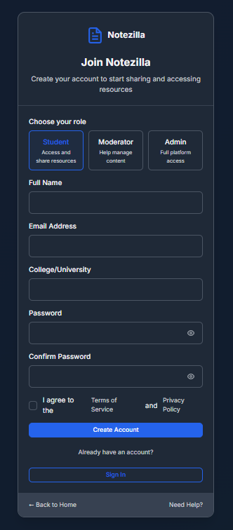
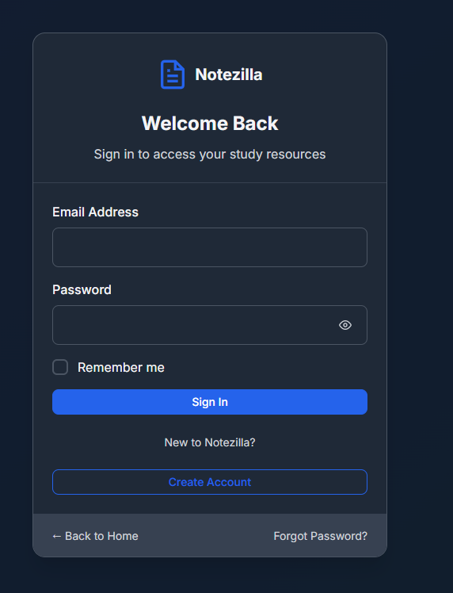

# Notezilla 📚✨  

**A collaborative academic platform for students to share and access study resources!**  

## Features 🌟  

- **📝 Upload & Download Notes** - Share and access study materials, past papers, and resources  
- **🎓 Role-Based Access** - Students, moderators, and admins with different permissions  
- **🔒 Secure Authentication** - Login, signup, and password management  
- **🌙 Dark Mode** - Toggle between light and dark themes for comfortable studying  
- **📊 Stats Dashboard** - Track uploads, downloads, and active users  

## Tech Stack 💻  

- **Frontend**: React.js, CSS  
- **Backend**: Mock API (for demo)  
- **State Management**: React Context API  
- **Routing**: React Router (if extended)  

## Setup & Installation 🛠️  

1. Clone the repository:  
   ```bash  
   git clone https://github.com/yourusername/notezilla.git  
   ```  
2. Install dependencies:  
   ```bash  
   cd notezilla  
   npm install  
   ```  
3. Run the app:  
   ```bash  
   npm start  
   ```  

## Screenshots 🖼️  

| **Login Page** | **Signup Page** | **Home Page** |  
|---------------|----------------|--------------|  
|  |  
## Future Enhancements 🚀  

- **🔍 Search Functionality** - Find notes by subject, college, or keywords  
- **📱 Mobile Optimization** - Responsive design for all devices  
- **💬 Discussion Forums** - Peer-to-peer Q&A and study groups  

## Contributing 🤝  

Pull requests are welcome! Open an issue first to discuss changes.  

## License 📄  

MIT  

---  

**Join Notezilla today and make studying easier! 🎉**  

---  


Made with ❤️ for students, by students! 📚✨
